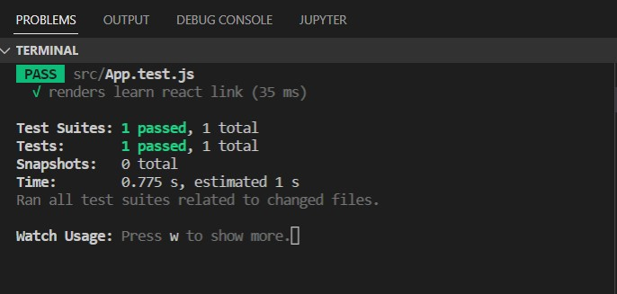

# Joyfull Jasper Week 6

# React - Redux

## Introduction Redux

Redux adalah salah satu library state management yang biasa disandingkan dengan react. Tujuanya adalah menyimpan state di satu tempat, sehingga lebih mudah untuk di manage.

## Cara Bekerja


1. **UI** : Tampilan Aplikasi
2. **Action** : Sebuah function yang me-_return_ sebuah objek. Objek tersebut memiliki sebuah property wajib yaitu type. Type inilah yang menentukan bagaimana statenya akan diubah.
3. **Reducer** : Adalah sebuah fungsi yang tugasnya untuk mengolah state yang ada di store. Misal menambah data, menghapus data, mengambil data, dsb.
4. **Store** : Store adalah tempat untuk menampung state. Jadi store ibarat database untuk frontend.

## Setup Redux

Instal Redux

```
npm install @reduxjs/toolkit
```

### 1. Membuat store dan koneksikan ke aplikasi react kita

- Import provider dari react redux dan masukan store ke dalam provider, di file index.js bungkus providernya

```
import { Provider } from "react-redux";
//untuk akses store
import store from "./store";

//render provider
<Provider store={store}>
      <App />
</Provider>
```

- Membuat store dengan menggunakan configure store, pertama buat folder store di dalam folder src. Kemudian tambahkan file index.js.

```
import { configureStore } from "@reduxjs/toolkit";
//akses book reducer
import bookReducer from "../Components/Books/BookSlice";
const store = configureStore({
  reducer: {
    tes: "test",
    book: bookReducer
  },
});

export default store;

```

- import store masuk ke provider, di file index.js

```
import store from "./store";
```

### 2. Buat komponen Slice dan View

contoh :
buat folder baru di folder components, dengan nama Books yang berisikan BookSlice.js dan BookView.js

Di file App.js jangan lupa import viewnya, lalu panggil BookView nya

```
import BooksView from "./Components/Books/BooksView";
//Panggil BookView
<BooksView />
```

- View hanya berisi teks aja

```
import React from 'react';
const BookView =()=> {
  return(
    <div>BookView</div>
  )
}

exprot default BookView;
```

- BooksSlice berisi createSlice untuk reducer yang dikirim ke store

```
import { createSlice } from "@reduxjs/toolkit";

const initialState = {
  totalBooks: 100,
};

const bookSlice = createSlice({
  name: "book",
  initialState,
  //reducers
  reducers: {
    //action borow
    borrow: (state) => {
      state.totalBooks--;
    },
  },
});

export default bookSlice.reducer;
export const { borrow } = bookSlice.actions;
```

- Store menerima createSlice dari BooksSlice, di App.js di tambahkan

```
import bookReducer from "../Components/Books/BookSlice";
```

### 3. Memunculkan state dari store redux

Menggunakan useSelector dalam komponen view

```
import { useSelector } from "react-redux";

const BooksView = () => {
  const totalBooksRedux = useSelector((state) => state.book.totalBooks);

  console.log("total :", totalBooksRedux);
  return (
    <div>
      <h3>Total Book : {totalBooksRedux}</h3>
    </div>
  );
};

export default BooksView;

```

### 4. Mengubah state dari store redux menggunakan action

Export action dari bookSlice
Buat button untuk melakukan useDispatch action

```
import { useSelector, useDispatch } from "react-redux";
import { borrow } from "./BookSlice";

const BooksView = () => {
  const dispatch = useDispatch();
  const totalBooksRedux = useSelector((state) => state.book.totalBooks);

  console.log("total :", totalBooksRedux);
  return (
    <div>
      <h1>BooksView</h1>
      <h3>Total Book : {totalBooksRedux}</h3>
      <button onClick={() => dispatch(borrow())}>borow</button>
    </div>
  );
};

export default BooksView;

```

## React Context

- Salah satu state management bawaan React JS
- variable global yang bisa akses dimana saja tanpa harus memparsing props ke setiap komponen.
- Tidak perlu instal apapun.

### Setup UseContext

- Buat folder baru context, untuk menampung isi contextnya, dan didalam folder tersebut isi dengan file baru. contohnya UserContext.js

```
import { useState, createContext, } from "react";

// buat dulu setup context dengan createContext
export const UserContext = createContext();

// komponen provider untuk menyediakan si data context
const UserContextProvider = (props) => {
  const [user] = useState({
    name: "skilvul",
    batch: "Joyfull Jasper",
  });

  return (
    //provider digunakan untuk mengirim data ke consumer
    <UserContext.Provider value={{ user, userData }}>
      {props.children}
    </UserContext.Provider>
  );
};
export default UserContextProvider;

```

- Kemudian untuk komponennya kita buat folder component yg berisi User.js yang menerima data dari contextnya

```
import { UserContext } from "../context/UserContext";

const User = () => {
  return (
    <UserContext.Consumer>
      {(userContext) => {
        const { user } = userContext;
        const { userData } = userContext;
        console.log(userData);
        return (
          <div>
            <h1>User Context</h1>
            <h3>Name: {user.name}</h3>
            <h3>batch: {user.batch}</h3>
          </div>
        );
      }}
    </UserContext.Consumer>
  );
};

export default User;

```

- Untuk menampilkan outputnya Di App.js kita panggil usernya

```
import "./App.css";
import User from "./components/User";import UserContextProvider from "./context/UserContext";

function App() {
  return (
    <div className="App">
      <UserContextProvider>
        <User />
      </UserContextProvider>
    </div>
  );
}

export default App;

```

## Bootstrap di React JS

Instal bootstrap di project React kita untuk menggunakan react-bootstrap

```
npm install react-bootstrap bootstrap
```

### Setup React-Bootstrap

```
// import css bootstrap

import 'bootstrap/dist/css/bootstrap.min.css';
```

di file index.js

### Components React-Bootstrap

Tombol / Button

```
import Button from 'react-bootstrap/Button';
//atau
import {Button} from 'react-bootstrap';

function TypesExample() {
  return (
    <>
      <Button variant="primary">Primary</Button>
    </>
  );
}

export default TypesExample;
```

info lebih lanjut
https://react-bootstrap.netlify.app/components/alerts

## React Testing

Testing React di gunakan untuk tes komponen di react,
perintah untuk melakukan test react

```
npm run test
```

Pada react testing sebenarnya sudah ada unit testing bawaanya. di file App.test.js

```
import { render, screen } from '@testing-library/react';
import App from './App';

test('renders learn react link', () => {
  render(<App />);
  const linkElement = screen.getByText(/learn react/i);
  expect(linkElement).toBeInTheDocument();
});

```

      

testing yg digunakan untuk mengecek tulisan "learn react", jika tulisan reactnya kita hapus pada unit testnya akan eror tetapi aplikasinya tetap berjalan.
      
      
      
