# Joyfull Jasper Week 9

# Backend Dev

## Introduction Node JS

_Node.js is a JavaScript runtime built on Chrome's V8 JavaScript engine. Node.js uses an event-driven, non-blocking I/O model that makes it lightweight and efficient. Node.js' package ecosystem, npm, is the largest ecosystem of open source libraries in the world._

Node.js itu secara sederhananya, merupakan platform JavaScript yang dapat berjalan di backend atau server-side, di komputer kita secara langsung.

## Arsitektur Node JS

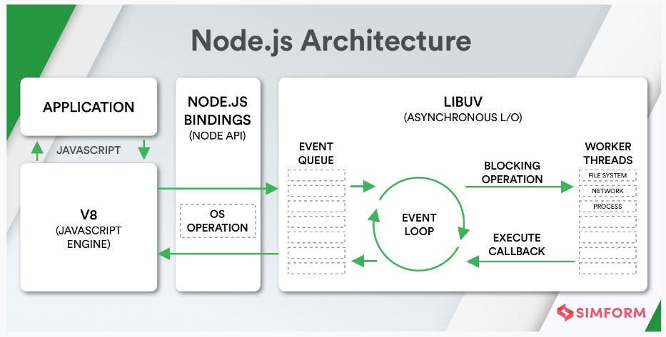

1. **Single Thread** : Javascript menggunakan konsep single thread, yang berarti hanya memiliki satu tumpukan panggilan yang digunakan untuk menjalankan program. Ketika terdapat perintah baru maka akan ditambahkan (push) dan akan di keluarkan ketika perintahnya sudah selasai (pop)
2. **Even Loop** : memfasilitasi kondisi **event queue** (sebagai penampung ketika terdapat perintah baru yang akan dieksekusi), event loop akan memeriksa terus menerus, ketika antrian kosong di call stack maka akan menambah antrian baru dari event queue sampai semua perintah selesai di eksekusi.
3. **Server side scripting** : Sejatinya javascript merupakan bahasa pemrograman yang digunakan di front end side. Tetapi dengan menggunakan NodeJS kita dapat menjalankan javascript di server side menggunakan terminal command line menggunakan perintah “node”
4. **Store** : Store adalah tempat untuk menampung state. Jadi store ibarat database untuk frontend.

## Instalasi Node JS

link : https://nodejs.org/en/
Untuk mengetes apakah berhasil terinstall, dapat menjalankan
“node -v” untuk mengecek versi NodeJS yang terinstal.

NodeJS ini juga dilengkapi dengan NPM (node package manager) dan dapat mengeceknya juga menggunakan “npm -v”

### Running Node JS

Kita dapat menggunakan node di terminal kita dengan mengetik **“node”** kemudian bisa membuat code javascript dan langsung dieksekusi

### Module Node JS

**1. Console** : merupakan module bawaan dari javascript yang ada di node JS untuk digunakan sebagai debug atau menampilkan code secara interface
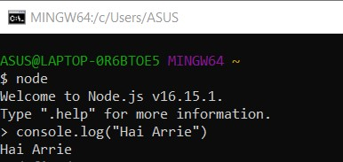

**2. Process** : adalah modules yang digunakan untuk menampilkan dan mengontrol prosess Node JS yang sedang dijalankan.


**3. OS** : merupakan module yang digunakan untuk menyediakan informasi terkait sistem operasi komputer yang digunakan user.

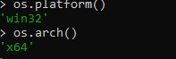

**4. Util** : merupakan alat bantu / utilities untuk mendukung kebutuhan internal API di Node JS

**5. Events**
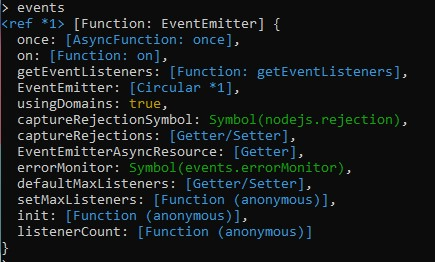

**6. Error** : merupakan modules yang dapat digunakan untuk mendefinisikan error di Node JS sehingga lebih informatif. Kita juga dapat menghandle error menggunakan "try catch"

**7. Buffers**: modules yang digunakan untuk mengakses, mengelola dan mengubah tipe data raw atau tipe data bytes

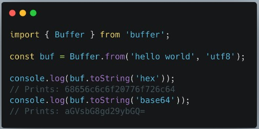

**8. FS** : Fs atau “file system” merupakan module yang dapat membantu berinteraksi dengan file yang ada diluar code. FS paling sering digunakan untuk membaca file dengan ekstensi .txt, .csv, dan .json
**9. Timers** merupakan modules yang digunakan untuk melakukan scheduling atau mengatur waktu pemanggilan fungsi yang dapat diatur di waktu tertentu

### Node JS Web Server

- Node.js memiliki built-in modul yang disebut HTTP, built-in modul ini memungkinkan Node JS mentransfer data melalui Hyper Text Transfer Protocol (HTTP).
- Untuk menggunakan modul HTTP, gunakan **require()**
- method createServer() untuk membuat server HTTP
- Callback function yang digunakan pada method **http.createServer()**, akan dijalankan ketika seseorang mencoba mengakses komputer pada port 8080.

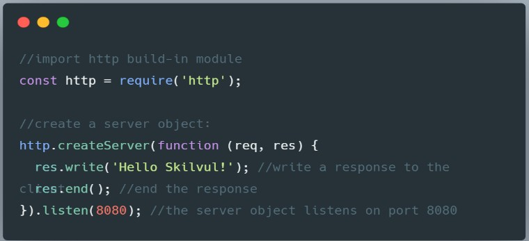

## Web Server & RESTful API

Web server terdiri dari 2 komponen penting:
**1. Hardware** : sebagai ruang penyimpanan **web server software dan komponen files** (HTML, Documents, Images, CSS, Javascripts). Web server yang terkoneksi pada internet mendukung pertukaran data dengan perangkat lain yang terhubung ke internet
**2. Software** : mencakup beberapa bagian yang mengontrol bagaimana user dapat mengakses file yang dihosting. Minimal adalah server HTTP. Server HTTP adalah perangkat lunak yang memahami URL (alamat web) dan HTTP (protokol yang digunakan browser untuk melihat halaman web).

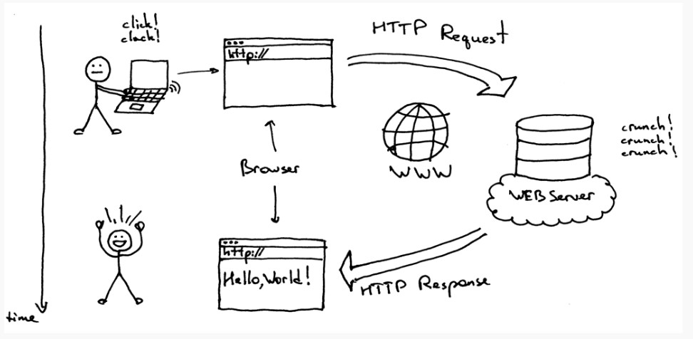

### Perbedaan Web Server Static dan Web Server Dinamis

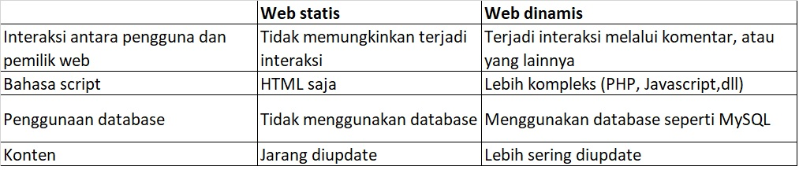

### REST

REST (Representional State Transfer) adalah suatu arsitektur metode komunikasi yang menggunakan protokol HTTP untuk pertukaran data dan metode ini sering diterapkan dalam pengembangan aplikasi. Dimana tujuannya adalah untuk menjadikan sistem yang memiliki performa yang baik, cepat dan mudah untuk di kembangkan (scale) terutama dalam pertukaran

### RESTful API / REST API

Implementasi dari API (Application Programming Interface). REST (Representional State Transfer) adalah suatu arsitektur metode komunikasi yang menggunakan protokol HTTP untuk pertukaran data dan metode ini sering diterapkan dalam pengembangan aplikasi. Dimana tujuannya adalah untuk menjadikan sistem yang memiliki performa yang baik, cepat dan mudah untuk di kembangkan (scale) terutama dalam pertukaran dan komunikasi data.

### Komponen REST API

**1. URL Design**
RESTful API diakses menggunakan protokol HTTP. Penamaan dan struktur URL yang konsisten akan menghasilkan API yang baik dan mudah untuk dimengerti developer. URL API biasa disebut endpoint dalam pemanggilannya.

**2. HTTP Verbs**

- GET : metode HTTP Request yang paling simpel, metode ini digunakan untuk membaca atau mendapatkan data dari sumber.
- POST metode HTTP Request yang digunakan untuk membuat data baru dengan menyisipkan data dalam body saat request dilakukan.
- PUT adalah metode HTTP Request yang biasanya digunakan untuk melakukan update data resource.
- DELETE adalah metode HTTP Request yang digunakan untuk menghapus suatu data pada resource.

**3. HTTP Response Code**
Secara umum terdapat 3 kelompok yang biasa kita jumpai pada RESTful API yaitu :

- 2XX : response code yang menampilkan bahwa request berhasil.
- 4XX : response code yang menampilkan bahwa request mengalami kesalahan pada sisi client.
- 5XX : response code yang menampilkan bahwa request mengalami kesalahan pada sisi server.

**4. Format Response**
Setiap request yang dilakukan client akan menerima data response dari server, response tersebut biasanya berupa data XML ataupun JSON.

## Express JS

Express adalah salah satu package NodeJS yang memungkinkan kita untuk membuat HTTP REST API ataupun aplikasi web dengan mudah.

### Instalasi Express

ExpressJS adalah sebuah modules atau package yang dikembangkan menggunakan bahasa javascript, maka kita bisa menggunakan NPM untuk menginstall express JS

```
npm install express
```

### Preparation

Terdapat beberapa module yang perlu diinstal untuk mempermudah develop server side application, seperti nodemon (agar dapat restart application otomatis selama proses development)

```
npm install -dev nodemon
```

## Basic Syntax expressJS

### Routes

End point yang diapat kita akses menggunakan URL di website. Didalam routes kita perlu menentukan method API, alamat dan response apa saja yang akan dikeluarkan

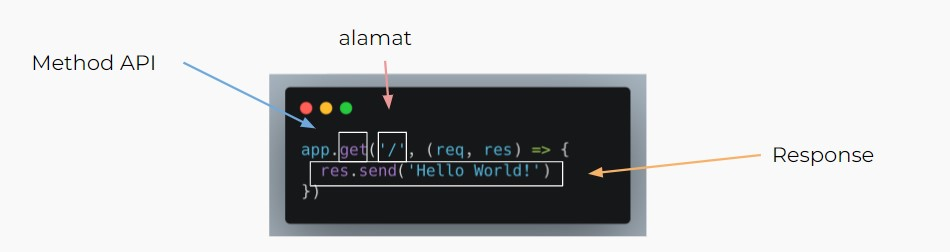

### Response

Di dalam route kita dapat mengirim response menggunakan parameter dari route express.js yaitu **“res.Send()”** untuk mengirim plain text ketika kita mengakses route tersebut.
Documentation : http://expressjs.com/en/api.html#res

### Status Code

Dalam pengaplikasian back end application, kita sangat perlu memberikan status code sebagai informasi apakah route yang kita akses berjalan sebagaimana mestinya dan tidak terjadi error.

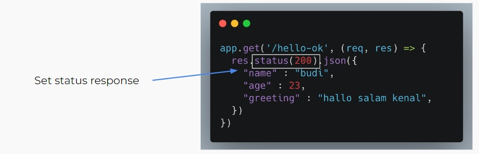

### Query

Query merupakan parameter yang digunakan untuk membantu menentukan tindakan yang lebih spesifik daripada hanya sekedar router biasa. Biasanya query ditaruh di akhir route dengan memberikan informasi diawali dengan “?” kemudian tedapat key dan data yang dapat ditindak lanjuti. Ex : **“?q=hello&age=23”**

### Nested route

digunakan ketika terdapat banyak route yang memiliki nama yang sama atau ingin membuat route yang lebih mendalam

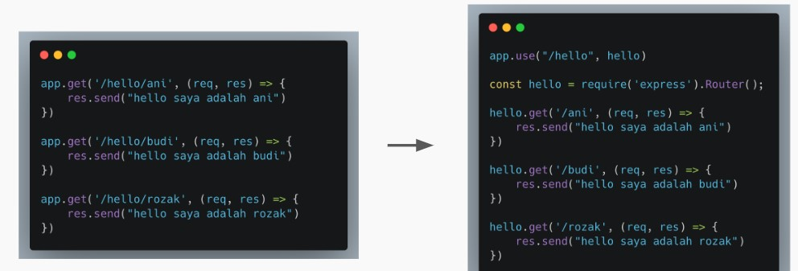

## Express Middleware

- Middleware function adalah sebuah fungsi yang memiliki akses ke object **request (req)**, object **response (res)**, dan sebuah fungsi **next** didalam request-response cycle.
- Fungsi next biasanya di berikan nama variable next.

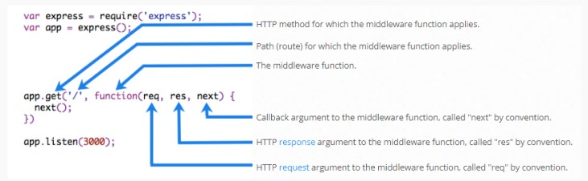

## Databases

- Database adalah kumpulan informasi yang disimpan didalam komputer secara sistematik dan saling berelasi.
- Database sekumpulan tabel yang berisikan informasi untuk diolah yang kemudian data tersebut bisa digunakan di dalam sebuah sistem.

### Database Management System (DBMS)

= software yang dapat digunakan oleh user untuk berkomunikasi dengan data yang ada dalam media penyimpanan.

- Tipe utama pada Database management System antara lain, Hierarchical, Network, Relational, Non Relational, and Object Oriented.

### Istilah pada Database

- Table : kumpulan value yang dibangun oleh baris dan kolom, yang didalamnya berisikan atribut dari sebuah data.
- Field : kolom dari sebuah tabel dimana masing-masing field memiliki tipe data masing-masing.
- Record : merupakan kumpulan nilai yang saling terkait. Record merupakan isi dari sebuah tabel.

### SQL

- SQL atau Structured Query Language merupakan suatu bahasa (Language) yang digunakan untuk mengakses database.
- SQL adalah Bahasa Query yang digunakan untuk melakukan interaksi di RDMS (Relational Database Management System)

## MySQL

Open source RDBMS berbasis SQL. Digunakan untuk mengoptimalkan aplikasi web dan dapat di jalankan dari berbagai platform. MySQL dapat berjalan stabil pada berbagai sistem operasi seperti Windows, Linux, MacOS dll.

### Instalasi MySQL

link : https://dev.mysql.com/downloads/installer

### SQL Command

```
SHOW DATABASES
```

menunjukkan seluruh list database di mysql kita

```
CREATE DATABASE nama_db;
```

membuat database baru

```
USE nama_db;
```

menggunakan database yang sudah ada

```
DROP DATABASES nama_db;
```

menghapus / menghilangkan database yang dipilih dari MySQL

```
SHOW TABLES;
```

melihat semua ini table di database

### Membuat Table Pada Databases

- Membuat table baru di database tersebut dengan nama “books”. Sintaks yang dibuat menggunakan **CREATE TABLE [name]** memberikan definisi tiap kolom di table tersebut.

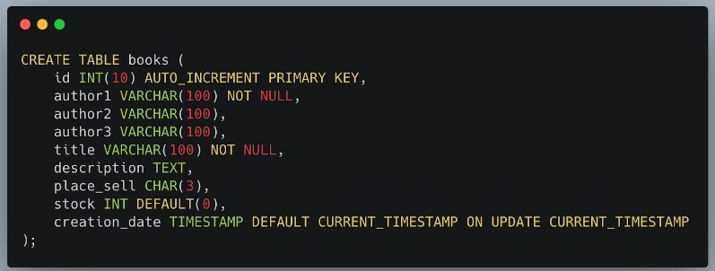

```
DROP TABLES nama_db;
```

menghapus table yang diinginkan jika ingin dihapus.

## DDL (Data Definition Language)

kumpulan perintah SQL yang digunakan untuk membuat, mengubah dan menghapus struktur dan definisi metadata dari objek-objek Database.

### ALTER

- Ketika ingin menambah atau menghilangkap kolom di table yang dipilih, kita bisa menggunakan **ALTER** dan menggunakan **ADD** untuk menambah kolom atau **DROP COLUMN** untuk menghapus kolom seperti contoh diatas.

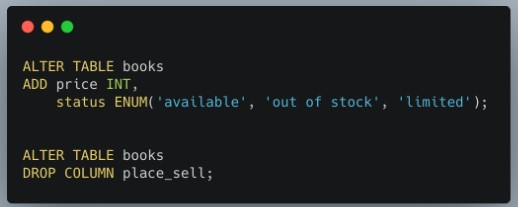

### INSERT INTO

perintah yang di gunakan untuk input data ke tabel

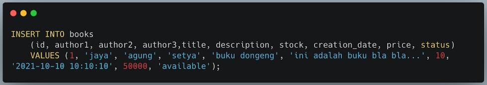

### INSERT INTO (multiple)

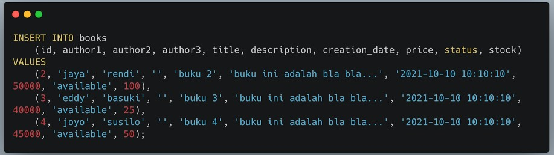

### SELECT

Digunakan untuk melakukan query melihat isi data di table yang dipilih

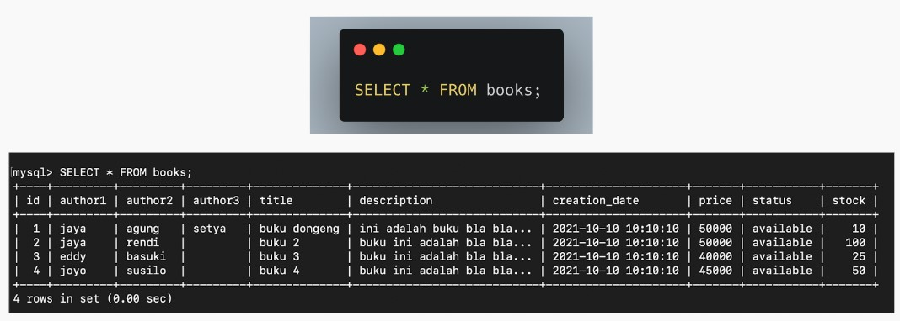

### SELECT ALIAS (AS)

**AS** untuk menggunakan mengubah nama kolom agar output kolomnya sesuai dengan yang kita inginkan

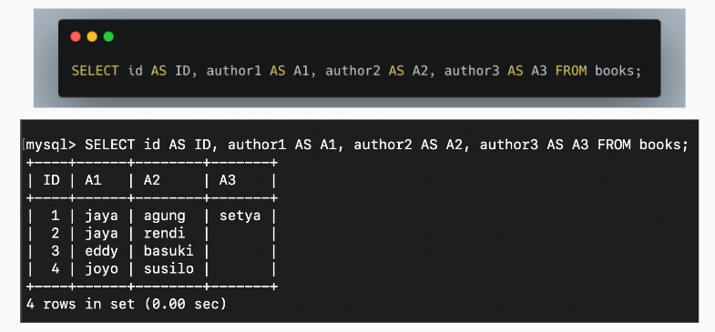

### WHERE

**WHERE** digunakan untuk mencari data dengan kondisi tertentu dengan command WHERE [column_name] = condition.

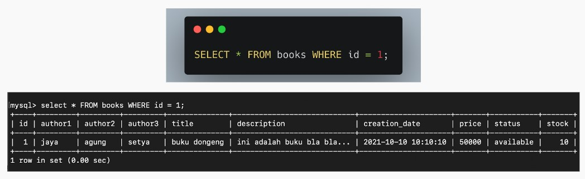

### AND, OR, NOT

**AND** untuk mencari query dengan kondisi lebih dari satu
**OR** untuk mencari query dengan kondisi salah satu.
**NOT** untuk mencari query yang tidak ada dalam kondisi yang di definisikan.
Contoh mencari row dengan kondisi id = 1 atau author1 = ‘eddy’. Maka kita akan muncul 2 row dengan salah satu kondisi yang di declare.

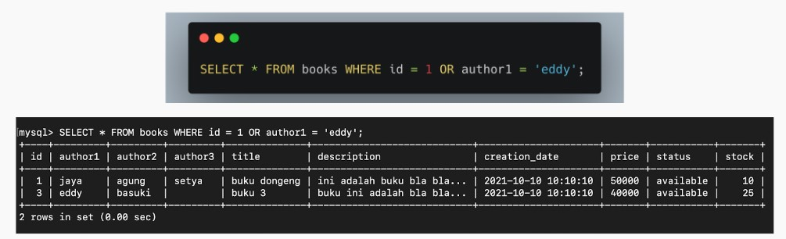

### ORDER BY

Untuk melakukan ordering menggunakan **ORDER BY** dengan menggunakan 2 kondisi yaitu ASC dan DESC. Struktur commandnya adalah ORDER BY [column_name] ASC / DESC.

### LIMIT

untuk membatasi berapa query yang akan dimunculkan dengan urutan dari atas.

### UPDATE

UPDATE digunakan untuk melakukan perbaruan data di table.

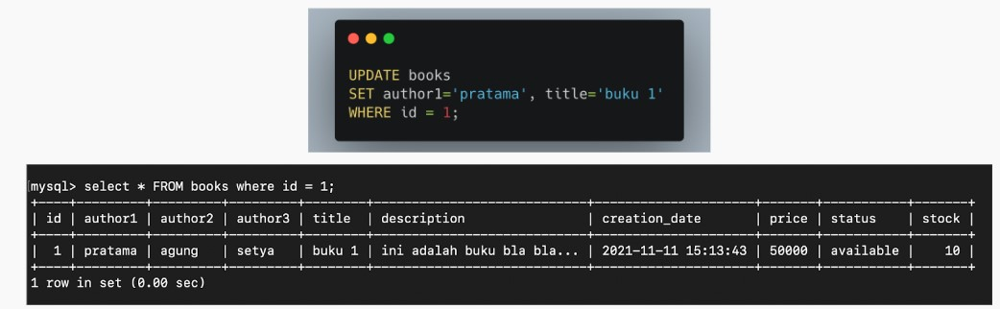

### DELETE

Digunakan untuk melakukan penghapusan data
**WARNING !!** ketika ingin melakukan delete jangan lupa menggunakan WHERE agar semua data tidak terhapus

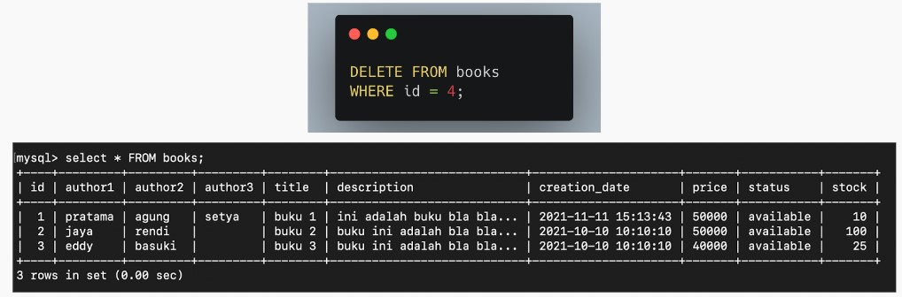

## Relasi di SQL

### 1. One to Many

- Paling Sering Digunakan
- Satu baris dalam tabel dapat memiliki beberapa baris di table relasinya

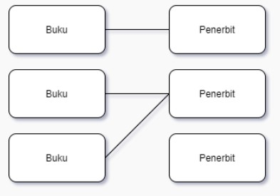

### 2. Many to Many

- Digunakan ketika kedua tabel yang berelasi dapat memiliki beberapa baris di tabel relasinya.

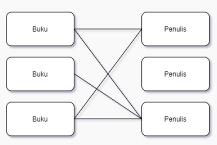

### 3. One to One

- Sangat jarang digunakan
- Diimplementasikan dengan cara yang sama seperti One to Many tetapi dengan kondisi tambahan (foreign key merupakan primary key)

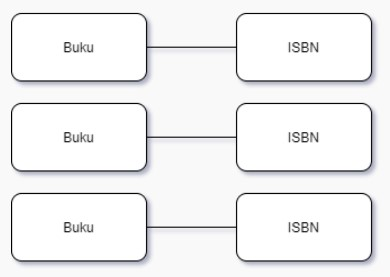

## Database Normalization

Teknik analisis data yang mengorganisasikan atribut-atribut data dengan cara mengelompokkan sehingga terbentuk entitas yang non-redundant, stabil, dan fleksible.

### Tujuan Database Normalization

- Menghilangkan redundan data pada database.
- Memudahkan juka ada perubahan struktur table database.
- Memperkecil pengaruh jika ada perubahan dari struktur table database.

## Bentuk Database Normalization

### 1. First Normal Form (1NF)

1. Menghilangkan multiple value pada sebuah kolom table database
2. Sebuah table memenuhi kaidah 1NF jika :
   -- Setiap kolom bernilai tunggal (single value)
   -- Setiap kolom memiliki nama yang unik
3. Urutan penyimpanan data tidak menjadi masalah

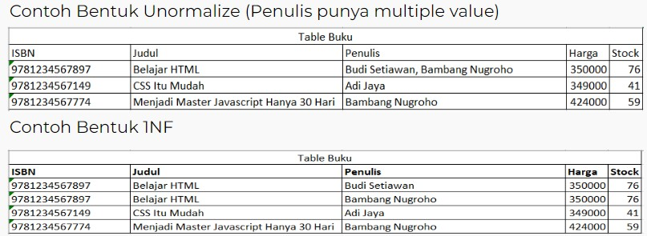

### 2. Second Normal Form (2NF)

1. Harus sudah dalam bentuk 1NF untuk mendapatkan 2NF
2. Menghapus beberapa subset data yang ada pada tabel dan menempatkan mereka pada tabel terpisah.

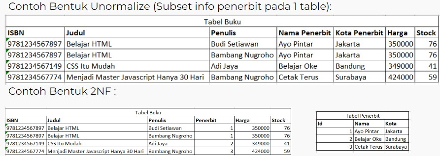

### 3. Third Normal Form (3NF)

Menghilangkan seluruh atribut atau field yang tidak berhubungan dengan primary key. Dengan demikian tidak ada ketergantungan transitif pada setiap kandidat key.

## Key di SQL

### 1. Super Key

- Kumpulan dari satu atau lebih dari satu key yang dapat digunakan untuk mengidentifikasi record secara unik dalam sebuah tabel.
- Super Key adalah superset dari Candidate Key.

### 2. Candidate Key

- Kumpulan satu atau lebih fields/columns yang dapat mengidentifikasi record secara unik dalam tabel.
- Bisa jadi ada beberapa Candidate Keys di dalam satu tabel
- Setiap Candidate Key bisa digunakan sebagai Primary Key.
  Candidate Key adalah super key yang tidak mempunyai value yang berulang

### 3. Primary Key

- Kumpulan satu atau lebih fields/columns dari sebuah tabel yang secara unik mengidentifikasi sebuah record dalam tabel database.
- Valuenya tidak boleh berupa null ataupun duplicate value.
  Hanya boleh salah satu Candidate Key yang bisa menjadi Primary Key.

### 4. Alternate Key

- Key yang bisa digunakan menjadi primary key.
- Pada dasarnya, Key ini merupakan candidate key yang tidak dijadikan primary key.

### 5. Unique Key

- Kumpulan dari satu atau lebih fields/columns di sebuah table database yang secara unik mengidentifikasi sebuah record dalam table database tersebut.
- Hampir sama dengan Primary key, namun value dari Unique Key bisa berupa satu buah null value di dalam sebuah table database, dan Unique Key tidak bisa memiliki duplicate values

### 6. Foreign Key

Field di sebuah table database yang menjadi Primary Key di table database lain.
Value dari Foreign key bisa menerima multiple null dan duplicate values.

## Join Multiple Table

### 1. Inner Join

- Semua baris akan diambil dari kedua table yang akan di JOIN, selama columns cocok dengan kondisi yang sudah di tentukan.
- Memungkinkan baris dari salah satu tabel muncul di hasil jika dan hanya jika kedua tabel memenuhi kondisi yang ditentukan dalam klausa ON.

### 2. Left Join

- Semua records dari table di sisi kiri JOIN statement akan di pilih.
- Jika record yang di pilih dari table kiri tidak memiliki record yang cocok pada table JOIN yang kanan, maka record tersebut masih dipilih, dan kolom pada table yang kanan akan bernilai NULL.

### 3. Right Join

semua records dari table di sisi kiri JOIN statement akan di pilih, bahkan jika table di sebelah kiri tidak memiliki record yang cocok.

## Aggregate Functions

Mengambil satu nilai setelah melakukan perhitungan pada sekumpulan nilai

### Tipe Aggregate Funtions

**1. MAX** : fungsi mengembalikan nilai terbesar dari kolom yang dipilih.
**2. MIN** : fungsi mengembalikan nilai terkecil dari kolom yang dipilih.
**3. SUM** : fungsi mengembalikan jumlah total kolom numerik.
**4. COUNT** : fungsi mengembalikan jumlah baris yang cocok dengan kriteria yang ditentukan.
**5. AVG** : fungsi mengembalikan nilai rata-rata kolom numerik

## UNION

- Digunakan untuk menggabungkan kumpulan hasil dari dua atau lebih pernyataan SELECT.
- Setiap pernyataan SELECT dalam UNION harus memiliki jumlah kolom yang sama
- Kolom juga harus memiliki tipe data yang serupa
- Kolom dalam setiap pernyataan SELECT juga harus dalam urutan yang sama

## GROP BY

- Mengelompokkan baris yang memiliki nilai yang sama ke dalam baris ringkasan
- Sering digunakan dengan fungsi agregat untuk mengelompokkan kumpulan hasil dengan satu atau lebih kolom.

## HAVING

HAVING ditambahkan ke SQL karena kata kunci WHERE tidak dapat digunakan dengan aggregate functions.
